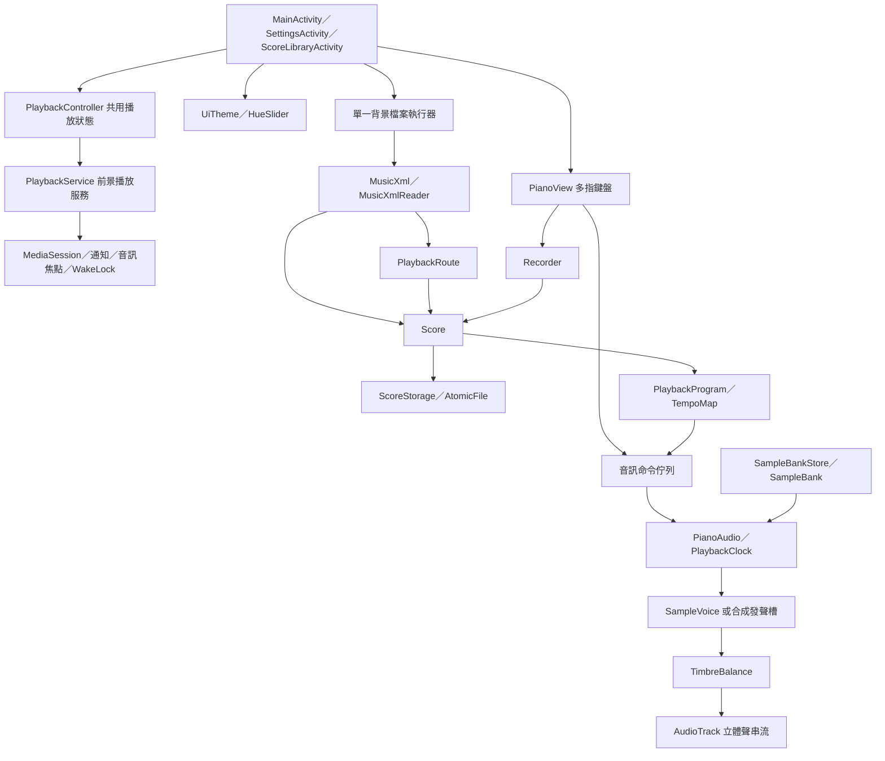

# 系統架構

## 1. 分層總覽

## 2. 模組責任

Java 元件位於 `app/src/main/java/com/minipiano/app/`。

| 模組 | 元件 | 責任 |
|---|---|---|
| 操作介面 | MainActivity | 彈奏、播放、錄製、檔案操作、聲部與摘要 |
| 設定 | SettingsActivity | 外觀、音色、音量與錄製偏好 |
| 音譜庫 | ScoreLibraryActivity、ScoreLibrary | 清單、播放、改名、刪除、摘要保存及舊資料移轉 |
| 播放生命週期 | PlaybackController、PlaybackService | 共用曲目／引擎、背景服務、通知、媒體控制、音訊焦點與 CPU 喚醒鎖 |
| 鍵盤 | PianoView | 黑鍵優先命中、多指追蹤、滑奏與動畫 |
| 外觀 | UiTheme、HueSlider | 色彩角色、系統列、色相與無障礙操作 |
| 音訊 | PianoAudio | 命令處理、64 發聲槽、混音與輸出 |
| 音色 | PianoSound、SampleBankStore | 選擇／遷移、單包快取與取消過期載入 |
| 採樣 | PianoSample、SampleBank、SampleVoice | WAV 解碼、音域映射、變調及衰減 |
| 響度 | TimbreBalance | 音色／音高查表、主音量與限幅 |
| 錄製 | Recorder | 手指音符、單調時間與踏板事件 |
| 曲目 | Score | 音符、聲部、速度、原譜及演奏小節 |
| 匯入／匯出 | MusicXml、MusicXmlReader | 包裝處理、解析、原譜保存與演奏譜寫出 |
| 演奏順序 | PlaybackRoute | 反覆、房次、跳轉與有限路徑 |
| 播放編譯 | PlaybackProgram | 不可變事件、聲部與 part 索引 |
| 時間 | TempoMap、PlaybackClock | tick／秒換算、倍率與實際音符年齡 |
| 保存 | ScoreStorage | 第 2 版 JSON、舊格式相容與原子寫入 |

## 3. 執行緒與狀態所有權

| 執行緒 | 工作 | 主要狀態 |
|---|---|---|
| UI／主執行緒 | 觸控、畫面、錄製事件、設定及對話框 | 手指狀態、介面目前曲目、偏好 |
| 主畫面檔案執行器 | 匯入、保存與匯出 | 解析中的曲目、保存快照 |
| 音譜庫檔案執行器 | 清單、讀取、改名及刪除 | 音譜摘要；進入音譜庫前先排空主畫面保存佇列 |
| 採樣載入執行器 | 載入單一音色包、PCM 解碼 | 載入代次、不可變銀行快取 |
| 音訊優先執行緒 | 時間排程、發聲槽及混音 | playing、cursor、踏板、靜音、音符包絡 |

UI 使用 `ConcurrentLinkedQueue<Runnable>` 傳遞命令；音訊執行緒在輸出區塊開始時接收命令。命令在 UI 配置，逐取樣混音不讀檔。畫面讀取播放位置、亮鍵遮罩及起音時間，約每 33 ms 更新。

`Score.copy()` 建立保存／播放快照；音符資料不可變。`ScoreStorage` 使用程序內共享鎖與 AtomicFile，序列化讀寫並避免部分檔案被讀取。

## 4. 手動彈奏路徑

1. PianoView 以 pointer ID 記錄每根手指。
2. 先測試黑鍵，再測試白鍵。
3. 音高改變時放開舊音，再送出新起音。
4. Recorder 記錄事件；PianoAudio 接收起音／放音命令。
5. 發聲槽選取採樣或合成波形，套用力度與響度補償。
6. 共用音量、節拍器及軟限幅後送入 AudioTrack。

手動演奏與自動播放分為兩個群組，停止／靜音自動播放不封鎖手動跟彈。

## 5. MusicXML 路徑

TempoMap 先計算分段速度的累積秒數，再把音符及踏板編譯成演奏事件。播放時不用 UI 計時器逐個觸發音符。

## 6. 採樣快取與切換

SampleBankStore 只公開一個所選銀行。每次切換增加載入代次，舊任務無法覆蓋新狀態；載入任務序列執行，舊 PCM 於失去引用後釋放。正在淡出的發聲槽可短暫保留個別舊採樣。

載入完成前使用合成音色並顯示狀態，補償曲線依實際發聲音色套用。

## 7. 外部介面

PlaybackController 使用 application Context 建立共用音訊引擎，持有曲目 ID、Score 與速度。MainActivity 釋放介面引用時，不會關閉播放服務持有的引擎。播放透過 mediaPlayback 前景服務取得音訊焦點；服務以 MediaSession 與通知提供控制，播放期間持有部分 CPU 喚醒鎖。沒有播放且沒有主畫面引用時，服務結束並釋放引擎。

MainActivity.onPause() 只結束錄製、釋放手動琴鍵與節拍器，不暫停音譜播放。返回音譜庫時，只有換曲才重新載入，改名只更新標題。服務不使用 START_STICKY 自動重播，程序被終止後不承諾恢復播放。

- 系統檔案選擇器：`ACTION_OPEN_DOCUMENT`／`ACTION_CREATE_DOCUMENT`。
- 音訊輸出：AudioTrack 與 AudioManager 裝置取樣率／緩衝資訊。
- 儲存：APP 私有檔案、SharedPreferences。
- 應用程式沒有伺服器、資料庫服務或網路播放 API。

實作取捨請見 [系統設計](SYSTEM_DESIGN.md)，詳細數值請見 [技術參考](TECHNICAL_REFERENCE.md)。
