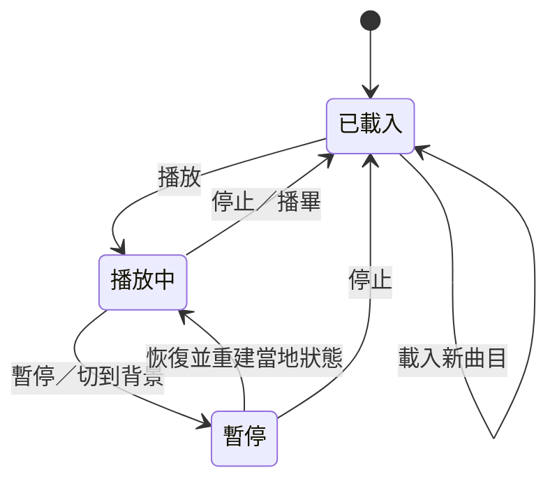
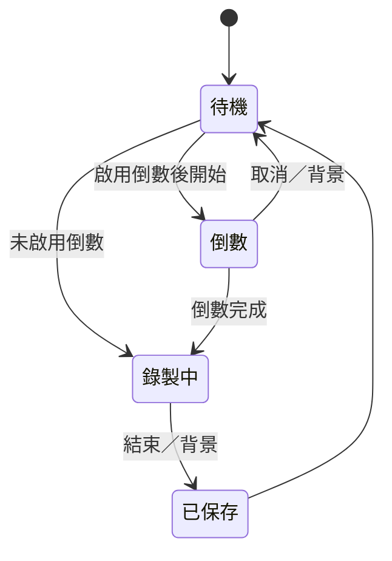

# 系統設計文件

## 1. 設計範圍

本版以離線即時彈奏、音樂事件錄製及 MusicXML 播放為核心。主介面只呈現鍵盤與播放資訊，設定使用獨立 Activity，資料保留一首目前曲目。

## 2. 使用情境與完成條件

| 情境 | 前提與主要流程 | 完成條件 |
|---|---|---|
| 試彈 | 開啟 APP、按下或滑動琴鍵 | 即時發聲，放開後正常衰減 |
| 和弦 | 多根手指觸控不同鍵 | 各手指獨立起音／放音 |
| 錄製 | 選速度、倒數後彈奏 | 音符與踏板保存，可回放及量化匯出 |
| 匯入 | 系統選檔、解析、摘要 | 曲目、原譜及聲部資訊保存 |
| 跟彈 | 自動播放並靜音部分聲部 | 自動事件仍推進，手動琴鍵可發聲 |
| 原譜轉存 | 目前曲目保有原 XML | 寫出原 XML，不重建記號 |
| 外觀切換 | 設定頁選模式／Hue | 即時預覽、返回後主畫面一致 |

## 3. 播放狀態

進度跳轉重置樂曲位置與歷史年齡基準；播放中跳轉會重建音符與踏板。變倍率只改樂譜時間推進速度，不改琴鍵音高。暫停時清理自動發聲，恢復時依已經聽過的時間重建採樣位置／合成相位，再短暫淡入。

## 4. 錄製狀態

錄製起點取單調時間，音符以起音和放音時間轉為 PPQ ticks。最後先放開手指／踏板，再保存完整事件。量化生成新 Score，不修改原紀錄。

## 5. 關鍵設計決策

### 5.1 原生 View 與 Java

使用現有 Android SDK 原生元件及自訂 Canvas 鍵盤，減少執行時相依套件；保留後續替換輸出引擎的空間。目前沒有 Compose 或 Oboe 實作。

### 5.2 持續音訊串流

AudioTrack 保持運作，發聲槽、查表及輸出緩衝預先配置。觸控時不建立獨立播放器或讀音色檔，降低重複啟動的成本。

### 5.3 作者時間與演奏時間分開

作者小節先解析，再展開為有限演奏路徑。TempoMap 轉換樂譜時間；PlaybackClock 另追蹤實際演奏秒數，避免用「目前倍率」錯誤回推已播放的長音年齡。

### 5.4 聲部與譜表身分

聲部鍵為 `part + U+001F + voice`。staff mask 保留聲部經過的譜表，跨譜表延音可合併；不同聲部的同音保持獨立。原譜身分不以音高猜測左右手。

### 5.5 原譜與演奏資料分開

原 XML 保留譜面資訊；播放資料則是已解讀、展開的事件。兩種匯出明確分開，避免量化、靜音或演奏順序展開破壞原譜。

### 5.6 單音色快取

只保留所選銀行，減少雙音色長期占用記憶體；切換時允許短暫舊音符淡出。載入代次用來拒絕過期任務發佈結果。

### 5.7 中性核取方塊列

錄製倒數與節拍器的整列使用中性色，只有勾選方框採主色。顯示模式、色彩、拍號等選擇則使用完整選中樣式，讓開關與單選操作容易辨識。

## 6. 非功能要求與實際狀態

| 項目 | 設計方式／實際狀態 |
|---|---|
| 反應速度 | 低延遲串流與優先執行緒；端到端延遲尚待真機量測 |
| 記憶體 | 銀行上限 64 MiB；穩定後保留單一音色 |
| 檔案處理 | 背景解析／寫入、原子保存、限制展開數量 |
| 相容性 | API 26 起，API 26／29／36 框架回歸 |
| 音樂正確性 | 分段時間、連續延音、力度範圍及有限路徑測試 |
| 可用性 | 高對比文字、48 dp 齒輪、Hue 無障礙操作、原生返回 |
| 可重現性 | 固定音色來源版本、每檔雜湊及離線量測工具 |

## 7. 邊界與簡化策略

不確定的文字速度不猜測，輸入不符合支援範圍時顯示摘要。中途跳轉以小節結尾執行並提示；不完整延音線分開起音；找不到跳轉目標不形成無限路徑。

對於無效檔案、解析例外或寫入失敗，保留可辨識的錯誤訊息。音色載入失敗可使用合成音色，詳見 [疑難排解](TROUBLESHOOTING.md)。
